# Architecture: Browser Coding Agent

## Overview

A browser-based coding agent that functions as an **intelligent runtime**. It combines LLM capabilities with a persistent JavaScript tool registry and a direct UI rendering channel. The agent runs entirely in a **Web Worker**, ensuring the main thread remains responsive for the UI.

**Storage Strategy:**
- **OPFS (Project Space)**: Strictly for repository source code and assets.
- **IndexedDB (User Space)**: Global Tool Registry, Session trees, and System metadata.

## Context

The agent enables developers to:
- Load GitHub repositories into a local OPFS-backed filesystem.
- Chat with an AI assistant that can read/write files and **generate live UI components**.
- Create custom JavaScript tools that persist globally across different projects.
- Maintain branching conversation histories.

## Design Philosophy

- **Registry-Based Execution**: Tools are first-class executable objects stored in IndexedDB, not static text files.
- **Global Utility**: Tools are "installed" into the user's environment, available across multiple repositories.
- **Agent as Runtime**: The agent doesn't just edit files; it emits events and code to the main thread to modify the UI in real-time.
- **Security First**: Dynamic tools and UI components require user approval before execution/rendering.
- **Zero-Latency Dispatch**: Tool definitions are loaded into memory on startup, eliminating file I/O during tool selection.

---

## System Context

The system follows a modular, event-driven JavaScript architecture organized into five main layers:


### Component Responsibilities

| Layer | Component | Responsibility |
| --- | --- | --- |
| **UI** | Chat UI | Renders chat interface. |
|  | **Preview Engine** | **New**: Dynamically registers and renders Web Components sent by the Agent. |
|  | Session Tree UI | Displays and navigates conversation branches. |
|  | Tool Approval UI | Intercepts new tool definitions and component renders for user consent. |
|  | Export UI | Handles session export to various formats. |
| **Core** | Event Bus | Central pub/sub messaging system. |
|  | Message Bridge | Handles communication (Worker ↔ Main). |
|  | API Client | Manages communication with LLM providers. |
| **Storage** | **Repo Store** | Manages project source code (OPFS). |
|  | **Global Store** | **New**: Stores the `tools` registry and `sessions` (IndexedDB). |
| **Agent** | **Tool Registry** | **New**: In-memory map of executable functions, hydrated from IndexedDB. |
|  | Agent Core | Manages the LLM loop and orchestrates tool execution. |
|  | Session Manager | Manages conversation state and branching. |

---

## Component Details

### Tool System Architecture (Registry Model)

Unlike the previous file-based model, the Agent does not scan directories. It loads a structured registry at startup.

```mermaid
flowchart TB
    subgraph AgentWorker["Integrated Agent (Worker)"]
        AgentCore["Agent Core"]
        Registry["Tool Registry (Map)"]
        Executor["Tool Executor"]
        
        subgraph Scope["Execution Sandbox"]
            API["External APIs"]
            OPFS["File System"]
            UIChannel["UI Event Channel"]
        end
    end
    
    subgraph Storage["IndexedDB"]
        DBTools["'tools' Store"]
    end
    
    %% Startup
    DBTools -->|1. Hydrate| Registry
    
    %% Execution Loop
    AgentCore -->|2. Get Definition| Registry
    AgentCore -->|3. Select Tool| AgentCore
    AgentCore -->|4. Invoke| Executor
    
    Executor -->|5. Lookup| Registry
    Registry -->|6. Return Function| Executor
    
    Executor -->|7. Execute| Scope
    Scope -->|8. Result| AgentCore
```



### Component Descriptions

#### Tool Registry (JavaScript/Memory)

* **Role**: The "Brain's Library."
* **Behavior**: On worker startup, it reads all valid tools from IndexedDB into a `Map<string, Tool>`.
* **Benefits**: Zero-latency lookups. Tools travel with the user, not the repo.

#### Tool Executor

* **Role**: The Runtime.
* **Behavior**: Executes the JavaScript functions.
* **Sandboxing**: Wraps execution in a scope that provides specific capabilities (`fetch`, `OPFS`, `postMessage` for UI updates) but restricts access to the raw Worker global scope.

#### Preview Engine (Main Thread)

* **Role**: The Visualizer.
* **Behavior**: Listens for `preview_component` messages.
* **Mechanism**:
1. Receives HTML/JS string.
2. Encapsulates it (Shadow DOM or `customElements.define`).
3. Mounts it to the chat stream or a dedicated preview panel.


---

## Data Model

### Tool Schema (IndexedDB)

Tools are stored as structured objects in the `tools` store of IndexedDB.

```javascript
{
  id: "uuid-555-666",        // Primary Key
  name: "fetch_weather",     // Unique Handle
  version: 1,
  
  // The logic (Executable)
  // Stored as string, hydrated to function via new Function()
  func: "async ({ city }) => { const res = await fetch(...); return res.json(); }",
  
  // The Interface (LLM Metadata)
  schema: {
    description: "Fetches weather data",
    parameters: { 
      type: "object", 
      properties: { 
        city: { type: "string" } 
      } 
    }
  },
  
  // Permissions & Metadata
  type: "system",            // "system" (built-in) or "user" (created)
  permissions: ["network"],  // "network", "fs", "ui"
  created: "2026-02-08T10:00:00Z"
}
```

### Session Schema (IndexedDB)

Remains similar, but `toolCalls` now reference the Registry ID.

```javascript
{
  sessionId: "uuid-123",
  root: { ... },
  // ... standard tree structure
}
```

### OPFS Structure

Cleaned up. No longer contains hidden configuration or tool definitions.

```
OPFS Root
└── repos/
    └── {owner}_{repo}/       // Pure Source Code
        ├── src/
        ├── package.json
        └── ...
```

---

## Sequence Diagrams

### 1. Dynamic Tool Creation (Registry Flow)


### 2. Self-Modifying UI Flow (Component Generation)


---

## Communication Protocol

### Main Thread → Worker

| Type | Payload | Description |
| --- | --- | --- |
| `init` | `{ apiKey, model }` | Initialize agent & hydrate Registry. |
| `load_repo` | `{ owner, repo }` | Mount a specific repo to the FS scope. |
| `approve_tool` | `{ toolId }` | User authorized a new tool. |
| `approve_preview` | `{ componentId }` | User allows component code to execute in UI. |

### Worker → Main Thread

| Type | Payload | Description |
| --- | --- | --- |
| `ready` | `{ toolCount }` | Registry loaded. |
| `tool_pending` | `{ toolObj }` | Request permission to save new tool. |
| `preview_component` | `{ tagName, script, styles }` | **Critical**: Instructions to render a UI element. |
| `step` | `{ content }` | Standard chat streaming. |

---

## Security Considerations

1. **Registry Sandbox**: Tools loaded from the registry are executed via `new Function()`. While cleaner than `eval()`, they still run in the Worker. The Worker must be CSP-restricted to prevent exfiltration if a malicious tool is imported.
2. **UI Isolation**:
* **Risk**: The `preview_component` channel allows the LLM to execute code on the Main Thread.
* **Mitigation**: Generated components should be rendered inside a **Shadow DOM** with `closed` mode, or strictly sanitized if not using Web Components.
* **Policy**: The agent should never automatically execute a UI component. The UI must present a "Render Preview" button for the user to click (Human-in-the-loop).

## Future Enhancements

1. **Tool Marketplace**: Since tools are just JSON objects, they can be easily imported/exported as simple JSON files or synced via a cloud backend.
2. **NPM Imports**: Allow tools to import packages from a CDN (e.g., esm.sh) to add capabilities (like `lodash` or `moment`) without bundling.