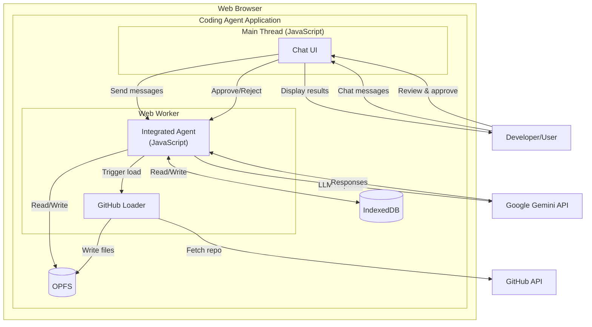
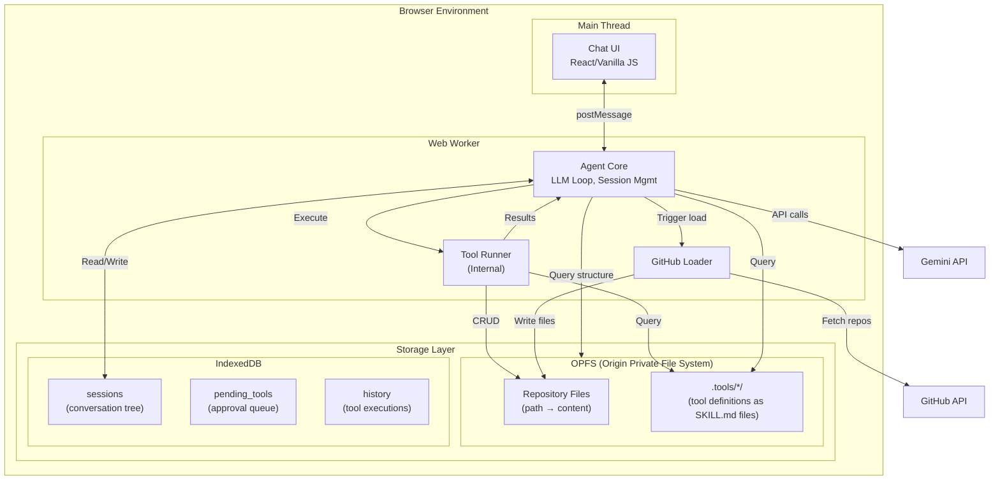
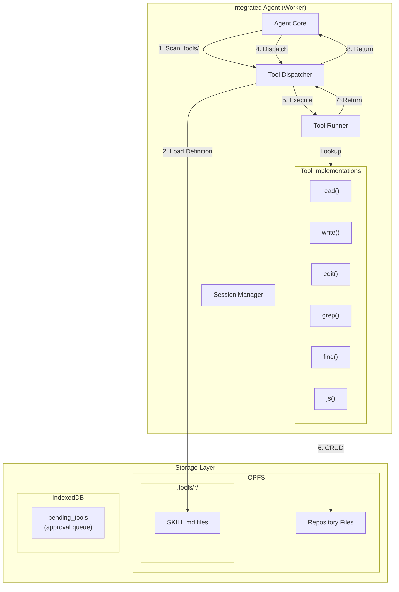

# Architecture: Browser Coding Agent

## Overview

A browser-based coding agent that combines LLM capabilities with a JavaScript tool execution environment. Uses a hybrid storage approach: OPFS (Origin Private File System) for file storage and IndexedDB for sessions, tools, and metadata. The agent runs entirely in a **Web Worker**, ensuring the main thread remains responsive for the UI.

**Storage Strategy:**
- **OPFS**: Repository files, tool definitions (large, hierarchical data, editable as files)
- **IndexedDB**: Session tree, tool execution history, pending tool approvals (structured, queryable data)

## Context

The agent enables developers to:
- Load GitHub repositories into a local OPFS-backed filesystem
- Chat with an AI assistant that can read, write, and edit files
- Create custom JavaScript tools dynamically
- Maintain branching conversation histories

## Design Philosophy

- **Simplicity over complexity**: Pure JavaScript architecture, no compilation steps (WASM/Rust) required for the agent core.
- **Dynamic extensibility**: Tools are stored as SKILL.md files in OPFS (`.tools/*/SKILL.md`), not hardcoded.
- **Security first**: Dynamic tools require user approval before execution.
- **Web-native**: Leverages browser capabilities (OPFS, IndexedDB, Web Workers, fetch).
- **Hot-reloadable**: New tools become available immediately after approval.
- **Transparent**: Users can read and edit tool definitions as regular files.

---

## System Context



---

## Container Architecture



### Container Responsibilities

| Container | Technology | Responsibility |
|-----------|-----------|----------------|
| Chat UI | JavaScript | User interface for chat, displays messages, tool approval UI |
| Integrated Agent | JavaScript (Web Worker) | LLM chat loop, session management, tool dispatch, file structure queries, tool execution |
| GitHub Loader | JavaScript (Web Worker) | Fetches repositories from GitHub API, writes files and tools to OPFS |
| OPFS | Browser API | File storage for repository contents and tool definitions (`.tools/` directory) |
| IndexedDB | Browser API | Session tree, pending tool approvals, execution history |

---

## Component Details

### Tool System Architecture



### Component Descriptions

#### Agent Core (JavaScript)
- Manages the LLM conversation loop
- Maintains session tree state
- Discovers tools by scanning OPFS `.tools/` directory at startup
- Queries OPFS for file structure to provide context to LLM
- Receives tool results and feeds back to LLM

#### Tool Dispatcher (JavaScript)
- Scans OPFS `.tools/` directory to discover available tools
- Parses SKILL.md files to extract frontmatter (name, description, allowed-tools)
- Loads full instructions from SKILL.md markdown content when tool is invoked
- Converts tool definitions to Gemini function declarations
- Routes incoming tool calls from LLM to appropriate handler

#### Tool Runner (JavaScript)
- Receives tool calls from the Dispatcher
- Executes tool with provided arguments
- Built-in tools are executed directly
- Dynamic tools (JS) are executed via `new Function` (sandboxed in Worker)
- Returns result to Dispatcher

#### Built-in Tools
All tools operate directly on OPFS from within the Worker:

| Tool | Purpose | OPFS Operations |
|------|---------|---------------------|
| `read` | Read file contents with line numbers | getFileHandle → read |
| `write` | Write/create files | getFileHandle → createWritable → write |
| `edit` | Surgical find-and-replace | read → modify → write |
| `ls` | List directory contents | Read directory entries |
| `grep` | Search file contents | Walk directory → read each |
| `find` | Discover files by pattern | Walk directory → filter paths |
| `js` | Execute JavaScript | Arbitrary (via user code) |

#### Session Manager (JavaScript)
- Manages branching conversation tree
- Persists session changes to IndexedDB
- Rebuilds conversation history for LLM from current branch

---

## Data Model


### Storage Schema

#### OPFS Structure
Repository files and tool definitions are stored in OPFS using a directory structure:
```
OPFS Root
└── repos/
    └── {owner}_{repo}/              // Repository root
        ├── src/
        │   └── index.js             // File content
        ├── package.json
        ├── .tools/                  // Tool definitions directory
        │   ├── count_lines.json     // Tool: count lines in a file
        │   ├── find_unused.json     // Tool: find unused code
        │   └── custom_analyzer.json // User-created tool
        └── ...
```

**File Operations:**
- **Read**: `root.getFileHandle(path).getFile().text()`
- **Write**: `root.getFileHandle(path, {create: true}).createWritable().write(content)`
- **Directory traversal**: Use `FileSystemDirectoryHandle` to walk the tree

#### Tool Definition Format (OPFS)

Tools are defined using the SKILL.md format inspired by Claude's Agent Skills system. Each tool is a directory containing SKILL.md with YAML frontmatter and markdown instructions.

```
OPFS Root
└── repos/
    └── {owner}_{repo}/              // Repository root
        ├── .tools/                  // Tools directory
        │   ├── count-lines/         // Tool directory
        │   │   ├── SKILL.md         // Tool definition (frontmatter + instructions)
        │   │   └── scripts/         // Optional bundled scripts
        │   │       └── count.js
        └── ...
```

#### IndexedDB Schema

Tools are stored as files in OPFS (`.tools/*.json`). IndexedDB is used for sessions, history, and pending tool approvals.

#### `pending_tools` Store
```javascript
{
  toolId: "uuid-789",           // Primary key
  name: "custom_analyzer",
  description: "Custom code analyzer",
  parameters: { ... },
  implementation: "...",
  created: "2026-02-07T10:30:00Z",
  status: "pending",            // "pending", "approved", "rejected"
  requestedBy: "llm",           // "llm" or "user"
  reason: "User requested custom analysis"
}
```

#### `sessions` Store
```javascript
{
  sessionId: "uuid-123",     // Primary key
  root: {
    id: "node-1",
    role: "user",
    content: "Hello",
    children: [...],
    parent: null
  },
  currentNodeId: "node-5",
  created: "2026-02-07T10:00:00Z",
  modified: "2026-02-07T10:30:00Z"
}
```

#### `history` Store
```javascript
{
  id: "uuid-456",           // Primary key
  sessionId: "uuid-123",
  timestamp: "2026-02-07T10:30:00Z",
  toolName: "read",
  arguments: { path: "src/main.rs" },
  result: { success: true, output: "fn main() {...}" }
}
```

---

## Sequence Diagrams

### Standard Tool Execution Flow


### Dynamic Tool Creation Flow (with Approval)


---

## Tool Execution Details

### Built-in Tools

All built-in tools are implemented in JavaScript and operate directly on OPFS within the Worker.

#### `read` Tool
```javascript
{
  name: "read",
  description: "Read file contents with optional line offset and limit",
  parameters: {
    type: "object",
    properties: {
      path: { type: "string", description: "File path to read" },
      offset: { type: "number", description: "1-indexed line number to start from" },
      limit: { type: "number", description: "Maximum lines to read" }
    },
    required: ["path"]
  }
}
```

#### `write` Tool
```javascript
{
  name: "write",
  description: "Write or overwrite a file",
  parameters: {
    type: "object",
    properties: {
      path: { type: "string", description: "File path" },
      content: { type: "string", description: "File content" }
    },
    required: ["path", "content"]
  }
}
```

#### `edit` Tool
```javascript
{
  name: "edit",
  description: "Edit a file with surgical find-and-replace",
  parameters: {
    type: "object",
    properties: {
      path: { type: "string", description: "File path" },
      oldText: { type: "string", description: "Text to find" },
      newText: { type: "string", description: "Replacement text" }
    },
    required: ["path", "oldText", "newText"]
  }
}
```

#### `ls` Tool
```javascript
{
  name: "ls",
  description: "List directory contents",
  parameters: {
    type: "object",
    properties: {
      path: { type: "string", description: "Directory path to list" },
      detailed: { type: "boolean", description: "Show detailed listing with permissions" }
    },
    required: ["path"]
  }
}
```

#### `grep` Tool
```javascript
{
  name: "grep",
  description: "Search file contents with regex pattern",
  parameters: {
    type: "object",
    properties: {
      pattern: { type: "string", description: "Regex pattern" },
      path: { type: "string", description: "Optional path to limit search" },
      ignoreCase: { type: "boolean" }
    },
    required: ["pattern"]
  }
}
```

#### `find` Tool
```javascript
{
  name: "find",
  description: "Find files by glob pattern",
  parameters: {
    type: "object",
    properties: {
      pattern: { type: "string", description: "Glob pattern like '*.rs'" },
      path: { type: "string", description: "Optional starting directory" }
    },
    required: ["pattern"]
  }
}
```

#### `js` Tool
```javascript
{
  name: "js",
  description: "Execute JavaScript code with access to file operations",
  parameters: {
    type: "object",
    properties: {
      code: { 
        type: "string", 
        description: "JavaScript code to execute. Available globals: read(path), write(path, content), grep(pattern), find(pattern), console" 
      }
    },
    required: ["code"]
  }
}
```

### Dynamic Tool API

Dynamic tools have access to helper functions injected into their execution scope:
- `read(path)`
- `write(path, content)`
- `grep(pattern, path?)`
- `find(pattern)`
- `console`

---

## Session Management Features

### Context Compaction (Automatic)

**Purpose**: Prevent context window overflow by automatically summarizing older conversation history while preserving the full session tree.

**Location**: Agent Core (Worker)

**Trigger Conditions**:
- **Proactive**: Token count approaches model limit (configurable threshold, default 80%)
- **Reactive**: API returns context overflow error

### Session Export

**Purpose**: Export session history to external formats for sharing, archiving, or analysis.

**Location**: UI command `/export` triggers Agent Core

**Export Formats**:
- JSONL (default)
- Markdown

---

## Communication Protocol

### Main Thread → Worker

| Type | Payload | Description |
|------|---------|-------------|
| `init` | `{ apiKey, model, repo }` | Initialize agent |
| `chat` | `{ message }` | Send user message |
| `branch` | `{ nodeId }` | Branch session at node |
| `load_repo` | `{ owner, repo }` | Trigger GitHub load |
| `get_history` | `{}` | Request current branch history |
| `get_tree` | `{}` | Request full session tree |
| `approve_tool` | `{ toolId }` | Approve pending tool |
| `reject_tool` | `{ toolId }` | Reject pending tool |

### Worker → Main Thread

| Type | Payload | Description |
|------|---------|-------------|
| `ready` | `{}` | Agent initialized |
| `step` | `{ type, content, toolCalls? }` | Agent step event |
| `tool_call` | `{ callId, name, arguments }` | Execute tool (notification only) |
| `tool_result` | `{ callId, result }` | Tool result (notification only) |
| `done` | `{ response }` | Final response |
| `error` | `{ message }` | Error occurred |
| `tool_pending` | `{ toolId, name, code }` | New tool awaiting approval |

---

## Security Considerations

1. **Dynamic Code Execution**: The `js` tool and dynamic tools use `new Function()`.
   - Code is generated by the LLM.
   - Runs in the **Web Worker** context, isolated from the main thread and DOM.
   - Limited scope: only injected file operations are available.

2. **Tool Approval**: Dynamically created tools require explicit user approval.
   - Tools are stored in `pending_tools` queue.
   - User reviews SKILL.md before execution.

3. **Storage Isolation**:
   - **OPFS**: Per-repository isolation (`repos/{owner}_{repo}/`).
   - **IndexedDB**: Namespaced by agent instance.

4. **API Keys**: Stored in Worker memory, never persisted.

---

## Future Enhancements

1. **Tool Marketplace**: Import tools from URLs or a shared registry.
2. **Streaming**: Add streaming LLM responses.
3. **File Explorer**: Optional UI component for visual file browsing.
4. **Multi-repo**: Support loading multiple repositories simultaneously.