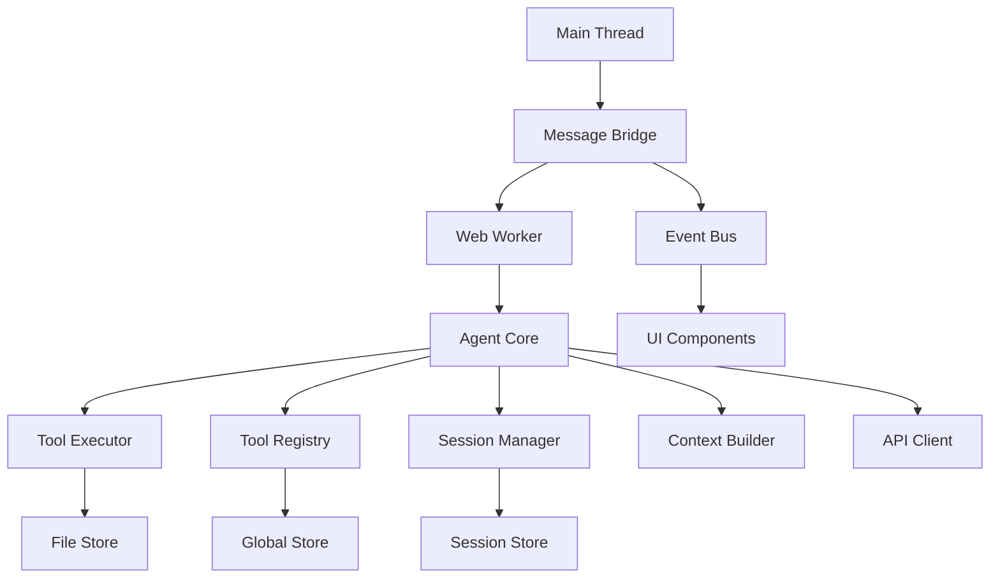
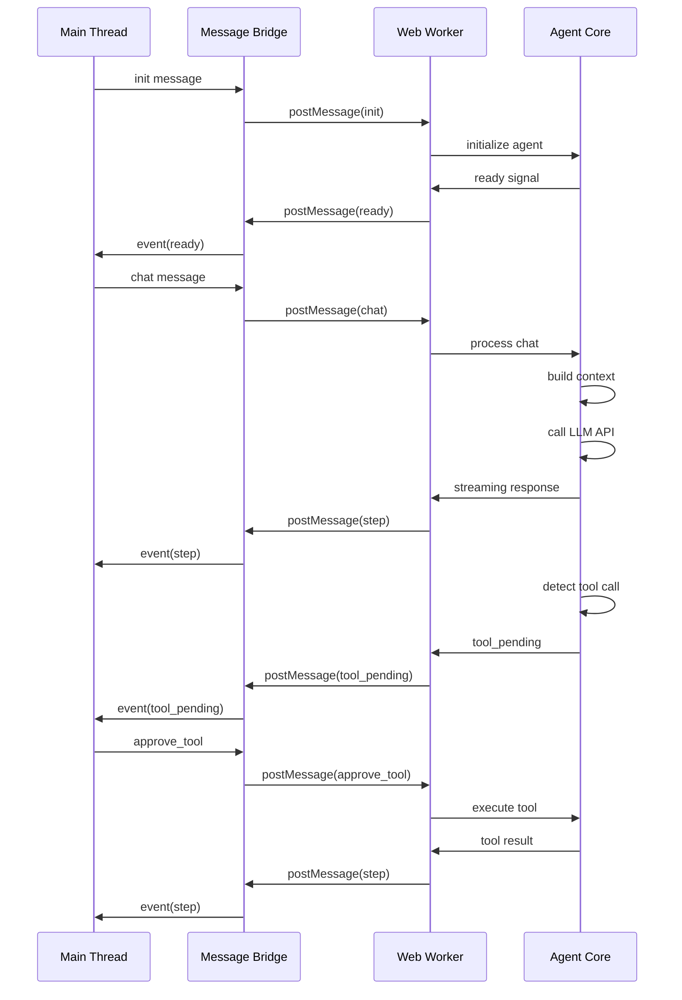

# 4.4 Web Worker Integration - Detailed Design Document

## Overview

This document provides a detailed design for the Web Worker Integration component of Phase 4, focusing on the worker entry point and message handling system. The integration enables secure, isolated execution of the AI agent in a Web Worker while maintaining seamless communication with the main thread UI.

## Architecture

### High-Level Architecture



### Web Worker Message Flow



## Files Structure

```
src/agent/
├── worker.js          # Worker entry point - handles message routing
├── agent.js           # Agent instantiation and lifecycle management
└── protocol.js        # Message protocol definitions and validation
```

## Message Protocol

### Main Thread → Worker Messages

```javascript
// Initialize the agent
{
  type: 'init',
  id: string,           // Unique request ID
  payload: {
    apiKey: string,     // LLM API key
    model: string,      // Model name (e.g., 'gpt-4')
    temperature?: number,
    maxTokens?: number,
    permissions?: string[]
  }
}

// Send chat message
{
  type: 'chat',
  id: string,
  payload: {
    message: string,    // User message
    sessionId: string   // Session identifier
  }
}

// Approve tool execution
{
  type: 'approve_tool',
  id: string,
  payload: {
    toolId: string,     // Tool call identifier
    approved: boolean   // Approval status
  }
}

// Load repository context
{
  type: 'load_repo',
  id: string,
  payload: {
    owner: string,      // GitHub owner
    repo: string,       // Repository name
    branch?: string     // Branch name
  }
}
```

### Worker → Main Thread Messages

```javascript
// Worker ready for operation
{
  type: 'ready',
  payload: {
    toolCount: number   // Number of loaded tools
  }
}

// Streaming response chunk
{
  type: 'step',
  payload: {
    content: string,    // Response content chunk
    sessionId: string,
    done: boolean       // Whether this is the final chunk
  }
}

// Tool execution pending approval
{
  type: 'tool_pending',
  payload: {
    toolId: string,
    tool: {
      name: string,
      description: string,
      parameters: object,
      permissions: string[]
    }
  }
}

// UI component preview
{
  type: 'preview_component',
  payload: {
    tagName: string,    // Component tag name
    code: string        // Generated component code
  }
}

// Error notification
{
  type: 'error',
  payload: {
    message: string,    // Error message
    code?: string,      // Error code
    details?: object    // Additional error details
  }
}
```

## Component Integrations

### Phase 1 Component Integrations

#### API Client Integration
- **Purpose**: LLM communication with streaming support
- **Integration Points**:
  - Agent Core uses API Client for all LLM requests
  - Streaming response handling for real-time UI updates
  - Token usage tracking and limits enforcement
  - Error handling for API failures (rate limits, network issues)
  - Model selection and configuration management
- **Validation**: API Client README confirms streaming support, retry logic, and multi-provider compatibility

#### Message Bridge Integration
- **Purpose**: Bidirectional Web Worker communication
- **Integration Points**:
  - Web Worker ↔ Main thread message forwarding
  - Message protocol implementation
  - Event forwarding between threads
  - Tool approval workflow coordination
  - UI component preview messaging
- **Validation**: Message Bridge README describes pub/sub pattern, event-based communication, and automatic reconnection

#### Event Bus Integration
- **Purpose**: System-wide event notifications
- **Integration Points**:
  - Tool execution events broadcasting
  - Session state changes notifications
  - Repository loading progress events
  - Error and status broadcasting
- **Validation**: Event Bus README confirms pub/sub messaging, error isolation, and system event constants

### Phase 2 Component Integrations

#### File Store Integration
- **Purpose**: Repository file access for context building
- **Integration Points**:
  - File content inclusion in LLM prompts
  - GitHub repository loading with progress tracking
  - File operation permissions in tool execution
  - Context compaction based on file relevance
- **Validation**: File Store README includes GitHub integration, file operations, and event notifications

#### Global Store Integration
- **Purpose**: Tool Registry and settings persistence
- **Integration Points**:
  - Tool Registry persistence (load/save tools)
  - Session tree storage and retrieval
  - Pending tool approval queue management
  - User settings and preferences storage
  - IndexedDB transaction management
- **Validation**: Tool Registry README mentions IndexedDB persistence and hydration

#### Session Store Integration
- **Purpose**: Conversation tree persistence
- **Integration Points**:
  - Conversation tree persistence with branching
  - Branch management and history reconstruction
  - Session metadata storage
  - Cross-session context sharing
- **Validation**: Session Manager README describes tree-structured storage and IndexedDB persistence

### Phase 3 Component Integrations

#### Tool Registry Integration
- **Purpose**: In-memory tool management
- **Integration Points**:
  - In-memory tool Map for O(1) lookups
  - Tool validation and registration
  - Event-driven tool updates
  - Registry hydration on startup
  - Tool lookup and execution dispatch
- **Validation**: Tool Registry README confirms in-memory storage, persistence, and event handling

#### Tool Executor Integration ⚠️ CRITICAL
- **Status**: Component exists but marked as missing in integration
- **Purpose**: Sandboxed tool execution environment
- **Integration Points**:
  - Permission enforcement for file/network/UI access
  - Execution timeout handling
  - Error isolation and reporting
  - Context passing (file access, UI events)
- **Validation**: Tool Executor README describes sandboxed execution, permission system, and timeout protection
- **Gap Analysis**: Component is implemented but may need integration testing

### Phase 5 Component Dependencies (Future)

#### UI Component Integration Points
- **Chat UI**: Message display and input handling
- **Tool Approval UI**: Pending tool workflow management
- **Session Tree UI**: Conversation branching visualization
- **File Browser UI**: Repository navigation
- **Export UI**: Conversation export functionality

## Implementation Plan

### Week 9 Schedule

#### Day 1: Worker Bootstrap
- Implement `worker.js` entry point
- Set up message event listeners
- Initialize core components (Agent, Message Bridge)
- Basic message routing

#### Day 2: Message Handlers
- Implement protocol.js with message validation
- Add handlers for init, chat, approve_tool, load_repo
- Error handling and response formatting
- Message ID tracking

#### Day 3: Protocol Implementation
- Complete message protocol in protocol.js
- Add response streaming for chat messages
- Tool pending/approval workflow
- Repository loading integration

#### Day 4: Error Handling
- Comprehensive error catching and reporting
- Worker crash recovery
- Message validation errors
- Timeout handling

#### Day 5: Integration Testing
- End-to-end message flow testing
- Component integration verification
- Performance benchmarking
- Error scenario testing

## Component README Locations

| Component | README Location |
|-----------|----------------|
| Agent Core | `components/agent/agent-core/README.md` |
| Message Bridge | `components/core/message-bridge/README.md` |
| Tool Executor | `components/agent/tool-executor/README.md` |
| Tool Registry | `components/agent/tool-registry/README.md` |
| API Client | `components/core/api-client/README.md` |
| Event Bus | `components/core/event-bus/README.md` |
| File Store | `components/storage/file-store/README.md` |
| Session Manager | `components/agent/session-manager/README.md` |
| Context Builder | `components/agent/context-builder/README.md` |

## Validation Against Component READMEs

### Agent Core Validation ✅
- **Web Worker Architecture**: Confirmed in README with Message Bridge integration
- **Tool System**: Integrates with Tool Executor and Tool Registry as described
- **Message Protocol**: Detailed protocol matches the design requirements
- **Component Dependencies**: All listed dependencies (session-manager, context-builder, api-client, message-bridge) are present

### Message Bridge Validation ✅
- **Bidirectional Communication**: Event-based forwarding between threads confirmed
- **Error Handling**: Automatic reconnection and error propagation implemented
- **Integration Pattern**: Pub/sub pattern matches the integration requirements

### Tool Executor Validation ⚠️
- **Sandboxed Execution**: Permission system and timeout handling confirmed
- **Integration Points**: File Store, Message Bridge, API Client integrations described
- **Status**: Component exists but requires integration testing (marked as "missing" in plan)

### Tool Registry Validation ✅
- **In-Memory Management**: Map-based storage with O(1) lookups confirmed
- **Persistence**: IndexedDB hydration and saving implemented
- **Event-Driven**: Registry events for tool changes

### API Client Validation ✅
- **Streaming Support**: Real-time chunk handling implemented
- **Multi-Provider**: Gemini and OpenAI support with unified interface
- **Error Handling**: Retry logic and error classification

### Event Bus Validation ✅
- **Pub/Sub Pattern**: Confirmed with error isolation
- **System Events**: Predefined event constants for system communication
- **Integration**: Zero dependencies, pure JavaScript implementation

### File Store Validation ✅
- **GitHub Integration**: Repository loading with progress tracking
- **Event Notifications**: File and repository events
- **Repository Management**: Namespacing and statistics

### Session Manager Validation ✅
- **Tree Structure**: Branching conversations with parent-child relationships
- **Persistence**: IndexedDB-based storage via Session Store
- **Web Worker Integration**: Message Bridge communication

### Context Builder Validation ✅
- **Tool Analysis**: Relevance scoring and ranking
- **Optimization**: Conversation compression within token limits
- **Integration**: Dependencies on Tool Registry and Session Manager

## Critical Gaps Identified

1. **Tool Executor Integration Testing**: Component exists but integration with Web Worker needs verification
2. **End-to-End Message Flow**: Complete message protocol testing across all components
3. **Performance Benchmarking**: Token limits, streaming performance, and memory usage
4. **Error Recovery**: Worker crash recovery and state synchronization

## Testing Requirements

### Cross-Component Communication Tests
- Message Bridge forwarding accuracy
- Event Bus event propagation
- Web Worker message serialization/deserialization

### End-to-End Tool Execution Workflows
- Tool approval workflow from detection to execution
- Permission enforcement in sandboxed environment
- Error handling and user feedback

### Web Worker Message Passing
- Message protocol validation
- Streaming response handling
- Worker lifecycle management

### IndexedDB Persistence Verification
- Tool Registry hydration
- Session tree persistence
- Settings and preferences storage

### File System Access in Sandboxed Environment
- File Store integration with Tool Executor
- Permission-based access control
- Repository context loading

## Conclusion

The Web Worker Integration design aligns well with existing component architectures. All major integrations are supported by the component READMEs, with the Tool Executor being the primary gap requiring integration testing. The message protocol provides a clean separation between main thread UI and worker-based agent execution, enabling secure and performant AI agent operation.</content>
<parameter name="filePath">/Users/weo/Development/aardvark/plans/04-phase-4-web-worker-integration.md
