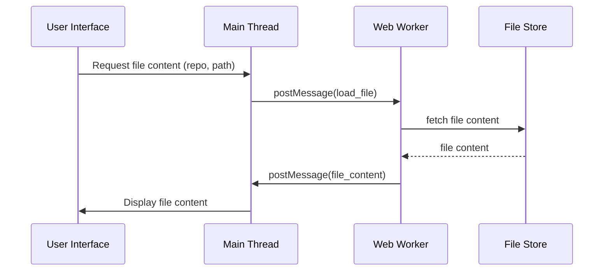
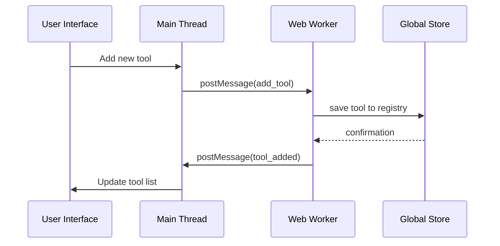
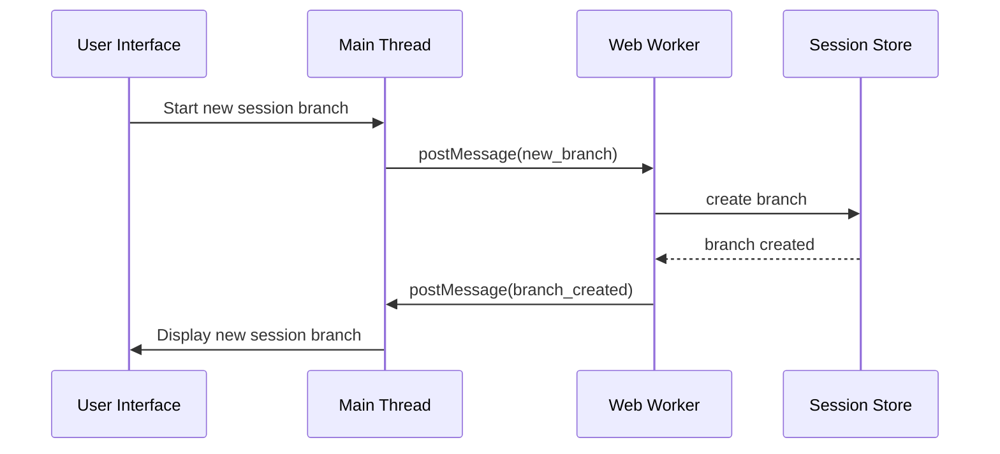
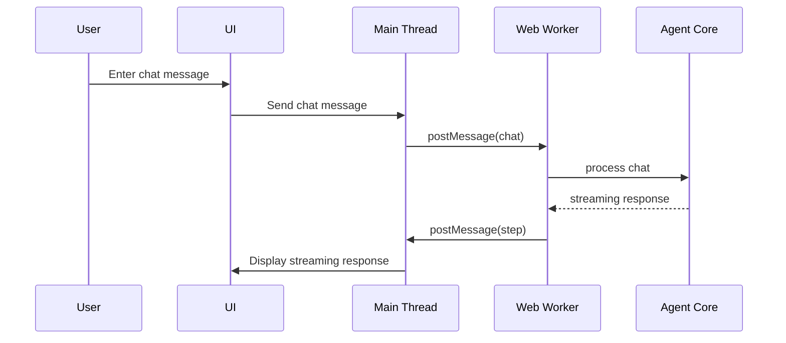
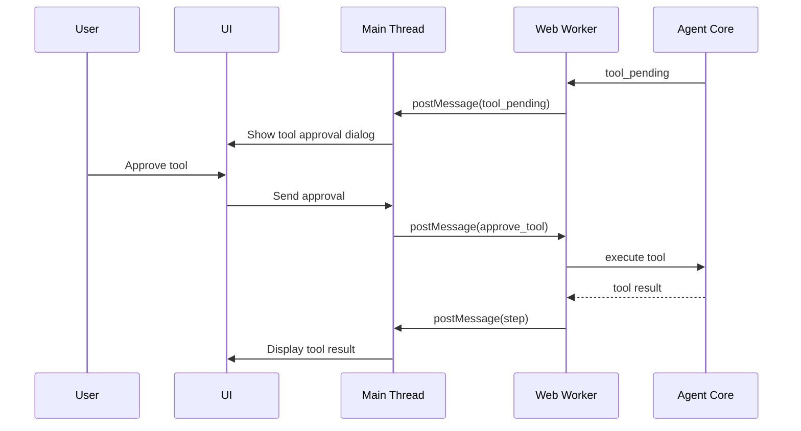
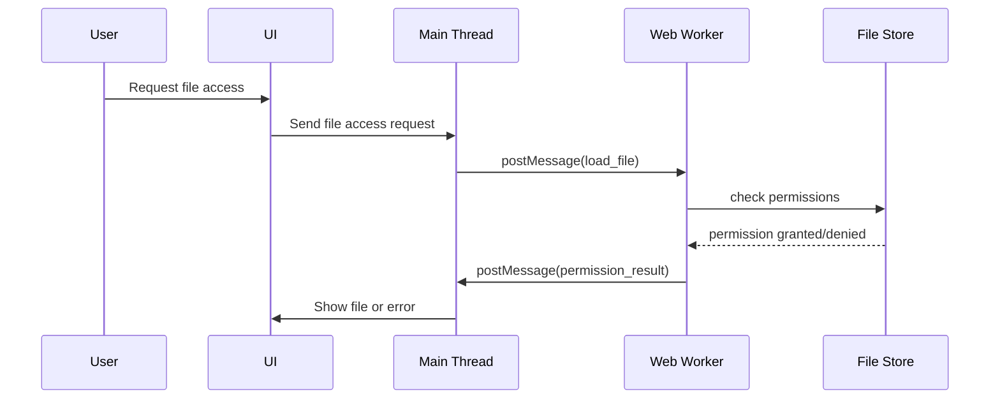
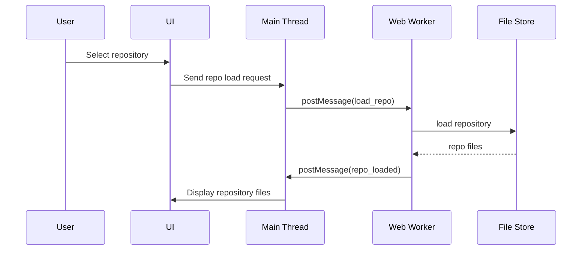
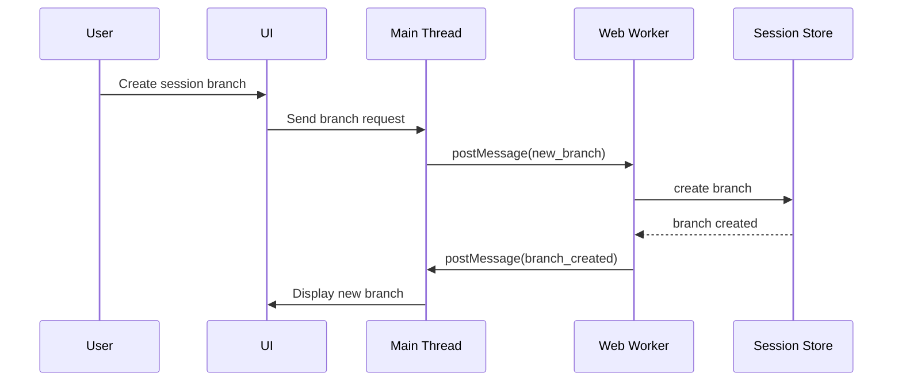
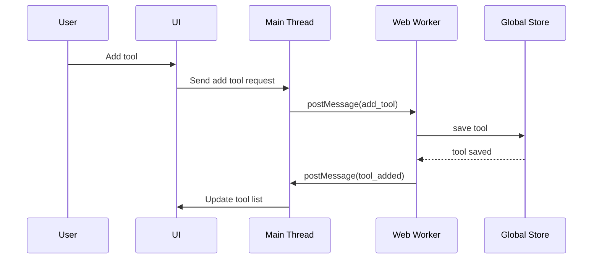

# Phase 4.2 Plan: Web Worker Integration

## 1. Component Integration
### Sequence Diagrams for Component Integrations

#### File Store: Repository File Access

#### Global Store: Tool Registry Persistence

#### Session Store: Conversation Tree Management

**Action Steps:**
- Implement File Store integration in worker.js for repository file access and context building.
- Connect Global Store for tool registry, session tree, and settings persistence.
- Integrate Session Store for conversation tree and session metadata management.

**Deliverables:**
- Updated worker.js with File Store, Global Store, and Session Store logic.
- Verified storage and retrieval operations for all stores.

## 2. Web Worker Implementation

**Action Steps:**
- Extend worker.js to handle file operations, session updates, and tool registry actions.
- Add message handlers for file access, session updates, and tool approval.
- Implement permission checks and robust error handling.

**Deliverables:**
- worker.js supporting all new actions and error scenarios.
- Message handler unit tests.

## 3. Message Protocol Extension

**Action Steps:**
- Define and document new protocol messages for file, session, and tool actions.
- Update protocol.js for validation and serialization/deserialization.

**Deliverables:**
- Updated protocol.js and documentation.
- Protocol tests for new message types.

## 4. Integration Testing

**Action Steps:**
- Write unit tests for worker message handlers.
- Test IndexedDB persistence for tool registry and session tree.

**Deliverables:**
- Passing unit tests for all handlers.
- Verified IndexedDB operations.

## 5. End-to-End Testing (E2E)
### Sequence Diagrams for E2E Test Use Cases

#### E2E: Chat Interaction

#### E2E: Tool Approval Workflow

#### E2E: File Access Permissions

**Action Steps:**
- Set up Puppeteer test harness for www/components/web_worker/index.html.
- Automate user flows: chat, tool approval, file access, session branching.
- Validate Web Worker message flow, streaming, and error handling.
- Test repository loading, file access permissions, and UI state sync.

**Deliverables:**
- puppeteer-e2e-tests.js (or similar) with full coverage.
- Test reports for all workflows.

## 6. Performance & Error Recovery

**Action Steps:**
- Benchmark streaming and token limits.
- Simulate worker crashes and test recovery/state sync.

**Deliverables:**
- Performance benchmarks.
- Recovery test cases and results.

## 7. Documentation

**Action Steps:**
- Update READMEs for File Store, Global Store, Session Store, and worker integration.
- Document message protocol extensions and E2E test setup.

**Deliverables:**
- Updated documentation in all relevant READMEs.
- E2E test setup guide.

---

## Full Featured Web UI Tests
### Sequence Diagrams for Full Featured Web UI Tests

#### UI Test: Repository Loading

#### UI Test: Session Branching

#### UI Test: Tool Registry Management

**Implementation Steps:**
- Extend www/components/web_worker/index.html with UI elements for:
	- Repository access and file loading (File Store)
	- Tool registry and session tree management (Global Store)
	- Conversation tree branching and metadata updates (Session Store)
- Add test scripts to simulate:
	- Repository loading and file access
	- Tool approval workflows
	- Session branching and metadata updates
- Use Puppeteer to automate:
	- UI interactions for all workflows
	- Assertions for UI updates, state sync, error handling, and persistence
	- Permission enforcement and recovery scenarios

**Deliverables:**
- Extended index.html with test UI and scripts.
- puppeteer-e2e-tests.js covering all integration points.
- Test results and coverage report.

---

This completion provides actionable steps, deliverables, and implementation details for each section, ensuring the plan is ready for execution and review. Let me know if you want code templates or test harness scaffolding next.
